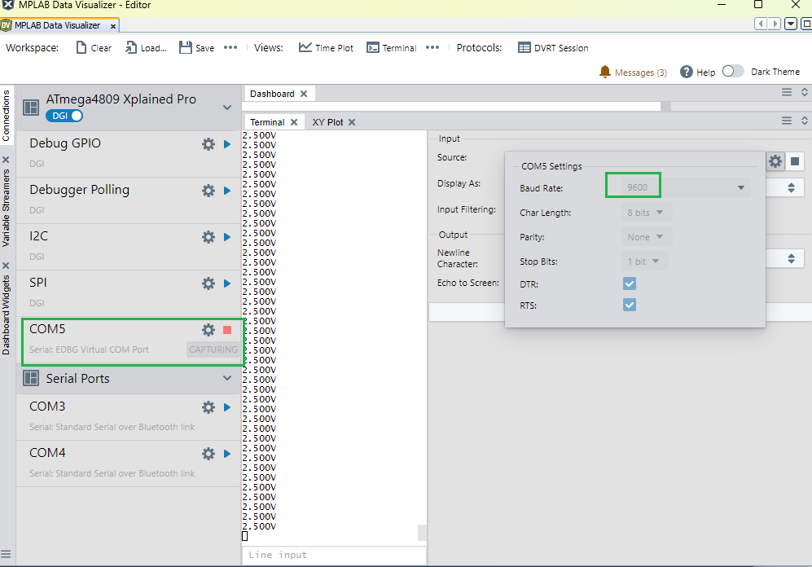

<!-- Please do not change this logo with link -->

<a target="_blank" href="https://www.microchip.com/" id="top-of-page">
   <picture>
      <source media="(prefers-color-scheme: light)" srcset="images/mchp_logo_light.png" width="350">
      <source media="(prefers-color-scheme: dark)" srcset="images/mchp_logo_dark.png" width="350">
      
   </picture>
</a>

# ATmega4809 Xplained Pro ADC Basics

MegaAVR® 0-series devices feature a 10-bit Successive Approximation Register (SAR) Analog-to-Digital Converter (ADC) capable of conversion rates up to 115 ksps. It features a flexible multiplexer, which allows the ADC to measure the voltage at multiple single-ended input pins.

There are four modes we will explore in this example:
*  ADC Free-Running mode
*  ADC Single Conversion mode
*  ADC Window Comparator mode
*  ADC Sample Accumulator mode

This is an example of how to get started with the ADC on the ATmega4809. This is based on the application note [AN2573](https://www.microchip.com/en-us/application-notes/an2573).

## Related Documentation

- [AN2573 - ADC Basics with tinyAVR 0- and 1-series, and megaAVR 0-series](https://www.microchip.com/en-us/application-notes/an2573)
- [ATmega4809 Device Page](https://www.microchip.com/wwwproducts/en/ATMEGA4809)

## Software Used

- [MPLAB® X IDE v6.25 or later](https://www.microchip.com/mplab/mplab-x-ide)
- [MPLAB® Data Visualizer](https://gallery.microchip.com/packages/MPLAB-Data-Visualizer-Standalone(Windows)/)
- [Studio Data Visualizer](https://www.microchip.com/mplab/avr-support/data-visualizer)
- [MPLAB® XC8 (v3.00)](https://www.microchip.com/mplab/compilers) alternatively [AVR/GNU C Compiler 5.4.0](https://www.microchip.com/mplab/avr-support/avr-and-arm-toolchains-c-compilers) can be used
- ATmega_DFP 3.3.279 or later

## Hardware Used

- [ATmega4809 Xplained Pro](https://www.microchip.com/developmenttools/ProductDetails/ATMEGA4809-XPRO)

## Setup

* Port PD6 is the ADC channel input. Connect a cable here to interact with the ADC.

 

## Operation

1. Download the zip file or clone the example to get the source code.
2. Open `atmega4809-adc-basics-mplab.X` in MPLAB.
3. Connect the ATmega4809 Xplained Pro to the computer with a micro USB cable.
4. Make sure the kit is selected as the tool to be programmed under project settings.
5. Press the **Make and Program** button to program the device.
6. Open the desired terminal application or Data visualizer and access the serial port associated with the Xplained Pro.
   

The [AN2573](https://www.microchip.com/en-us/application-notes/an2573) application note shows how to adjust the voltage level of the ADC input port, and the corresponding approximated value will be displayed via UART using the Data Visualizer.

## Conclusion

We have here shown how to setup and get started with the ADC basics project. For further information about this example and the functionality of the ADC, refer to the [AN2573](https://www.microchip.com/en-us/application-notes/an2573) application note.